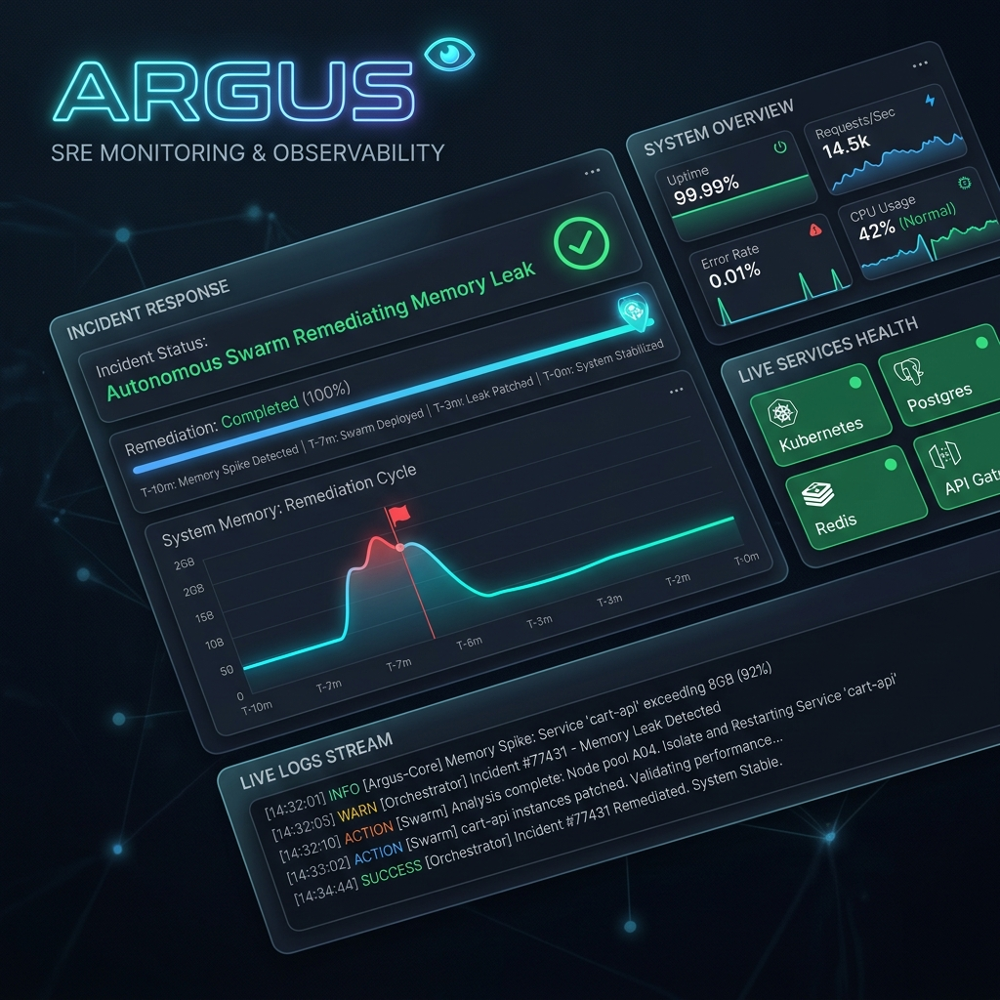
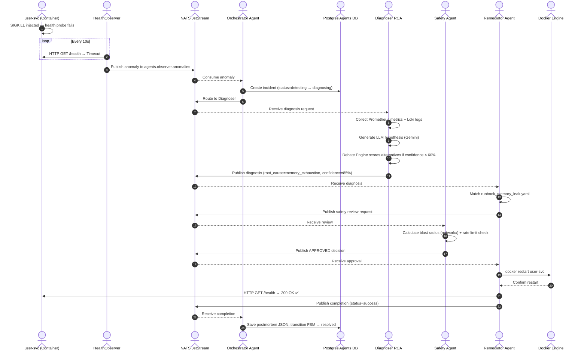
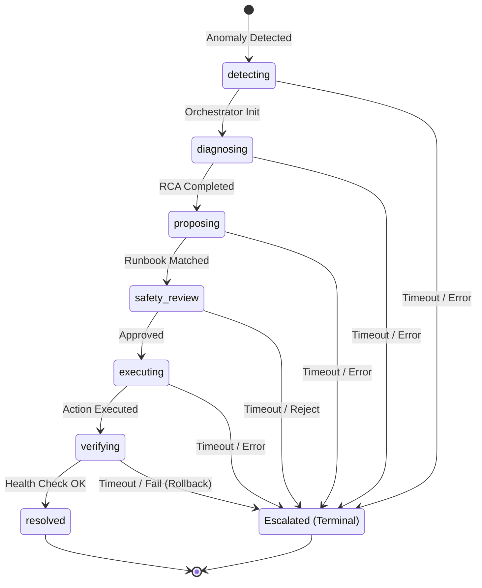
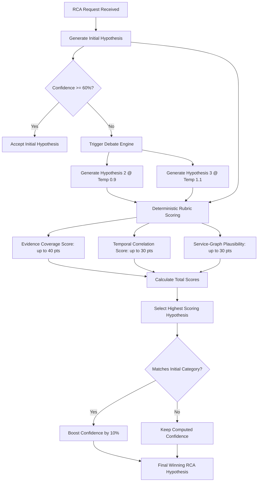

# ⚡ ARGUS — Autonomous Remediation & Guardian for Unified Systems

> When your infrastructure cries, ARGUS answers — before you even wake up.

<p align="center">
  
  
  
  
  
  
  
  
  
  
  
  
  
</p>

<p align="center">
  
</p>

---

## 📌 Table of Contents

* [💡 What is ARGUS?](#-what-is-argus)
* [📊 Key Metrics](#-key-metrics)
* [🏗️ System Architecture](#-system-architecture)
  * [High-Level Architecture](#high-level-architecture)
  * [Incident Lifecycle Sequence](#incident-lifecycle-sequence)
  * [Incident Finite State Machine](#incident-finite-state-machine)
* [🤖 Agent Roster](#-agent-roster)
* [🛠️ Tech Stack](#️-tech-stack)
* [🚀 Quick Start](#-quick-start)
  * [Prerequisites](#prerequisites)
  * [Installation \& Boot](#installation--boot)
  * [Trigger a Live Incident (Chaos Injection)](#trigger-a-live-incident-chaos-injection)
  * [Run the Test Suite](#run-the-test-suite)
* [🔍 How the LLM Debate Engine Works](#-how-the-llm-debate-engine-works)
* [📚 RAG-Powered Incident Memory](#-rag-powered-incident-memory)
* [🛡️ Safety Architecture](#-safety-architecture)
  * [Blast Radius Calculation](#blast-radius-calculation)
  * [Rate Limiting \& Cooldowns](#rate-limiting--cooldowns)
  * [Human Approval Gateway](#human-approval-gateway)
  * [Banned Targets](#banned-targets)
* [📡 Observable by Design](#-observable-by-design)
* [🧪 Chaos Testing Framework](#-chaos-testing-framework)
* [📁 Repository Structure](#-repository-structure)
* [🔮 Known Limitations \& Future Roadmap](#-known-limitations--future-roadmap)
* [📡 NATS Subject Map](#-nats-subject-map)
* [🎙️ Interview Elevator Pitch](#️-interview-elevator-pitch)
* [🤝 Contributing \& License](#-contributing--license)

---

## 💡 What is ARGUS?

Production microservice architectures generate cascading alert storms the moment a single component degrades. On-call engineers are forced to manually correlate logs, trace Prometheus metrics, find the root cause, consult runbooks, get approvals, execute fixes, and verify recovery — all at 3 AM. Mean Time to Resolve (MTTR) stretches to tens of minutes. Alert fatigue causes misses. Humans make mistakes under pressure.

ARGUS is an autonomous swarm of six specialized AI agents that close this entire loop — from anomaly detection to verified remediation — in seconds, not minutes. Observers watch every heartbeat. The Orchestrator manages incident state via a Finite State Machine. The Diagnoser debates root causes using LLMs. The Safety Agent calculates blast radius before touching anything. The Remediator executes Docker actions and rolls back if recovery fails. The Learner vector-embeds every resolved incident into ChromaDB so history is never forgotten.

---

## 📊 Key Metrics

| Metric | Value |
|--------|-------|
| **Mean Time to Detect (MTTD)** | < 10 seconds |
| **Mean Time to Resolve (MTTR)** | < 60 seconds (automated) |
| **Safety Gate Coverage** | 100% of all remediation actions |
| **FSM States Tracked** | 7 (detecting → resolved) |
| **Concurrent Incident Handling** | Unlimited (async NATS) |
| **RAG Memory** | ChromaDB vector store, `all-MiniLM-L6-v2` embeddings |
| **LLM Fallback Chain** | Gemini → OpenAI → Heuristics |

---

## 🏗️ System Architecture

### High-Level Architecture

```mermaid
graph TD
    User([User Client]) --> APIGateway[Nginx API Gateway]
    
    subgraph Microservices Stack
        APIGateway --> UserService[User Service]
        APIGateway --> OrderService[Order Service]
        OrderService --> PaymentService[Payment Service]
        OrderService --> InventoryWorker[Inventory Worker]
        UserService --> Redis[(Redis Sessions)]
        OrderService --> PostgresOrders[(Postgres Orders)]
        PaymentService --> PostgresPayments[(Postgres Payments)]
    end
    
    subgraph Observability
        Prometheus[(Prometheus)] <--> UserService
        Prometheus <--> OrderService
        Prometheus <--> PaymentService
        Prometheus <--> InventoryWorker
        Loki[(Grafana Loki)] <--> UserService
        Loki <--> OrderService
        Loki <--> PaymentService
        Loki <--> InventoryWorker
    end
    
    subgraph SRE_Swarm ["SRE Swarm (Message Bus)"]
        NATS{{"NATS JetStream Bus"}}
    end
    
    subgraph Agent Swarm
        MetricsObs[Metrics Observer] -.-> NATS
        HealthObs[Health Observer] -.-> NATS
        LogsObs[Log Observer] -.-> NATS
        SyntheticProber[Synthetic Prober] -.-> NATS
        
        Orchestrator[Orchestrator Agent] <--> NATS
        Diagnoser[Diagnoser RCA] <--> NATS
        Safety[Safety Agent] <--> NATS
        Remediator[Remediator Agent] <--> NATS
        Learner[Learner Agent] <--> NATS
    end
    
    subgraph Dashboard UI
        DBBack[FastAPI API Backend] <--> DBWS[(WebSocket Bridge)]
        DBWS <--> DashboardFE[React UI Dashboard]
        DBBack <--> NATS
    end
    
    Orchestrator <--> PostgresAgents[(Postgres Agent DB)]
    Learner <--> PostgresAgents
    Learner <--> ChromaDB[(ChromaDB Vectors)]
    
    classDef infra fill:#f9f,stroke:#333,stroke-width:2px;
    classDef agent fill:#bbf,stroke:#333,stroke-width:2px;
    class NATS,PostgresAgents,ChromaDB,Redis,Prometheus,Loki infra;
    class Orchestrator,Diagnoser,Safety,Remediator,Learner agent;
```



ARGUS sits as an autonomous layer above your existing microservices stack, observing Prometheus/Loki telemetry, coordinating all agents over NATS JetStream, and exposing a real-time human operator dashboard.

### Incident Lifecycle Sequence



### Incident Finite State Machine



---

## 🤖 Agent Roster

| Agent | Role | Superpower |
|-------|------|------------|
| **🔭 Observer (×4)** | Anomaly Detection | Scrapes Prometheus, Loki, HTTP probes, and synthetic E2E flows every 10 seconds. Uses z-score dynamic thresholds and OLS linear regression for early warnings. |
| **🧠 Orchestrator** | Incident Lifecycle | Maintains a Finite State Machine per incident, recovers state from PostgreSQL on restart, escalates to humans on timeout. |
| **🔍 Diagnoser** | Root Cause Analysis | Invokes Gemini/OpenAI at multiple temperatures, runs a debate engine scoring candidates on evidence (40 pts), temporal correlation (30 pts), and graph plausibility (30 pts). |
| **🛡️ Safety** | Guardrails & Blast Radius | Calculates dependency graph blast radius via NetworkX, enforces sliding-window rate limits (3/hr), and hard-blocks banned infrastructure targets like postgres and redis. |
| **⚙️ Remediator** | Action Execution | Matches diagnoses to YAML runbooks, executes Docker restarts via the Docker socket, runs health verification, and auto-rolls back if verification fails. |
| **📚 Learner** | Vector Memory | Embeds every resolved incident using SentenceTransformers (all-MiniLM-L6-v2) into ChromaDB. Surfaces similar past incidents and their proven runbooks to the Diagnoser via RAG. |

---

## 🛠️ Tech Stack

| Category | Technologies |
|----------|--------------|
| **Languages** | Python 3.11+, Go 1.22, JavaScript (React) |
| **Message Broker** | NATS JetStream (persistent streams, at-least-once delivery) |
| **Databases** | PostgreSQL (incident store), Redis (session store) |
| **Vector Store** | ChromaDB + `all-MiniLM-L6-v2` SentenceTransformers |
| **LLM Providers** | Google Gemini (primary), OpenAI GPT-4 (fallback), Heuristics (offline fallback) |
| **Observability** | Prometheus, Grafana, Loki, Tempo, Promtail |
| **Container Runtime** | Docker, Docker Compose |
| **Web Framework** | FastAPI (agents & dashboard API), Nginx (API Gateway), React (dashboard UI) |
| **Key Libraries** | SQLAlchemy, asyncpg, httpx, networkx, docker-py, Pydantic v2, structlog |
| **Testing** | pytest, pytest-asyncio, chaos injection scripts |

---

## 🚀 Quick Start

### Prerequisites
* Docker 24+ & Docker Compose v2
* Python 3.11+
* Go 1.22+
* Make
* NATS CLI (optional)

### Installation & Boot

```bash
# 1. Clone the repository
git clone https://github.com/sre-agent/argus-sre.git
cd argus-sre

# 2. Start all infrastructure (NATS, Postgres, Redis, Prometheus, Loki, Tempo)
make infra-up

# 3. Initialize NATS JetStream streams
make init-nats

# 4. Initialize PostgreSQL schemas for the agent database
python init_schema.py

# 5. Start the full microservices stack + all SRE agents
make up

# 6. Open the real-time operator dashboard
open http://localhost:3000
```

### Trigger a Live Incident (Chaos Injection)

```bash
# Inject a CPU spike into the user-service
python scripts/chaos/injector.py --scenario cpu_spike --target user-svc

# Inject a memory leak
python scripts/chaos/injector.py --scenario memory_leak --target payment-svc

# Watch ARGUS detect, diagnose, and resolve autonomously:
docker compose logs -f orchestrator-agent remediator-agent
```

### Run the Test Suite

```bash
wsl -d Debian sh -c ".venv/bin/python -m pytest shared/tests/ agents/orchestrator/tests/ -v"
```

---

## 🔍 How the LLM Debate Engine Works

LLMs can hallucinate and return low-confidence answers when presented with complex cascading failures in distributed systems. A single database timeout can trigger CPU spikes and gateway timeouts downstream. If the LLM makes a blind guess based on a single log string, it risks executing the wrong remediation (like restarting a healthy service, making the outage worse).

To solve this, when the primary Gemini call returns a confidence score under 60%, the Diagnoser triggers the **DebateEngine**. This engine generates two alternative root cause hypotheses by querying the LLM at higher temperatures ($0.9$ and $1.1$). This introduces structural variance, yielding more creative but potentially more accurate candidate diagnoses.



Each candidate hypothesis is evaluated against a 100-point deterministic rubric:
1. **Evidence Coverage (up to 40 pts):** How many of the observed anomaly signals (logs, alerts, metrics) are explained by the proposed root cause?
2. **Temporal Correlation (up to 30 pts):** Does the timeline show the proposed cause preceding the downstream effects chronologically?
3. **Service-Graph Plausibility (up to 30 pts):** Does the causal path make sense topologically based on the directed service dependency graph?

The candidate with the highest rubric score is selected. If this winner matches the category of the initial hypothesis, the engine boosts the final confidence by 10% to reflect multi-temperature consensus. The result is a root cause analysis that is AI-powered but mathematically validated.

---

## 📚 RAG-Powered Incident Memory

The **Learner Agent** bridges active incident resolution with operational history using vector similarity search. This prevents the agent swarm from repeating mistakes and speeds up diagnosis for recurring outages.

1. **Serialization & Embedding:** When an incident is marked as `resolved`, the Learner packages its timeline, metrics, Loki log snippets, the final root cause, and the runbook used into a structured text document. It embeds this text locally using SentenceTransformers (`all-MiniLM-L6-v2`) into a 384-dimensional vector and upserts it into **ChromaDB**.
2. **Retrieval-Augmented Generation (RAG):** When a new incident is detected, the Diagnoser queries ChromaDB for the top-3 nearest neighbor incidents by cosine distance. The summaries of these past incidents are injected into the LLM prompt context, showing the model how identical symptoms were resolved previously.
3. **Feedback Loop:** Runbook success and failure metrics are tracked persistently in PostgreSQL. If a runbook succeeds, its weight in PostgreSQL is incremented. If it fails, its weight is reduced, prompting the Remediator to try alternative recovery paths for similar future incidents.

---

## 🛡️ Safety Architecture

Autonomous remediation requires strict boundaries. The **Safety Agent** acts as a policy gateway, ensuring no action is executed unless it satisfies structural safety policies.

### Blast Radius Calculation
Before executing any action, the Safety Agent uses **NetworkX** to build and traverse the directed dependency graph of the active stack. If a restart is proposed for container $A$, the agent calculates the ratio of upstream services that depend on $A$ (ancestors). If restarting a service impacts more than 50% of the stack, the blast radius is marked as `high`. Core infrastructure nodes (Postgres databases, Redis, NATS) are hardcoded to a `critical` risk level with a 1.0 impact score.

### Rate Limiting & Cooldowns
To prevent catastrophic feedback loops (such as infinite restart cycles), every action is fingerprinted by hashing the combination of its `action_type` and `target_container`. The Safety Agent queries the active incident database to ensure:
* No container is targeted more than **3 times per hour**.
* A minimum **15-minute cooldown** has elapsed since the last execution on that target.

### Human Approval Gateway
If a proposed action fails static checks, exceeds the blast radius threshold (> 0.5), or hits a manual check rule, it transitions to the `safety_review` state. The Orchestrator halts execution and publishes a structured payload to the `human.approvals` topic. This pushes the incident state to the operator dashboard via WebSockets. The action is frozen until a human clicks **Approve** or **Reject** on the UI, which writes back to NATS to resume or close the state machine.

### Banned Targets
Core stateful stores (like `postgres-orders`, `postgres-payments`, `redis`, and `nats`) are placed on an absolute blocklist. Automated container restarts are physically blocked for these targets. If they experience issues, the Safety Agent rejects automated remediation and escalates directly to human operators.

---

## 📡 Observable by Design

ARGUS does not operate in a black box. It integrates with a complete CNCF-aligned observability stack to gather raw signals and expose its own telemetry:

* **Prometheus + Grafana:** Every microservice under SRE care exposes standard Prometheus `/metrics`. Grafana dashboards trace request rates, errors, CPU, and memory.
* **Loki + Promtail:** Standard out/error streams from containers are collected by Promtail, shipped to Loki, and queryable by agents using structured LogQL queries.
* **Tempo:** Distributed tracing is hooked into HTTP middleware, letting the Diagnoser follow trace propagation across service boundaries to pinpoint downstream latencies.
* **Agent Heartbeats:** Every running agent task spawns a background thread that publishes a heartbeat JSON to NATS on `agents.heartbeat` every 30 seconds. The Orchestrator tracks this registry, updating agent statuses in PostgreSQL and exposing them on the frontend.
* **Dashboard WebSocket Bridge:** The FastAPI backend subscribes to JetStream streams (`incidents.lifecycle`, `agents.heartbeat`) and broadcasts them to the React frontend in real-time, displaying incident state transitions dynamically.

---

## 🧪 Chaos Testing Framework

ARGUS includes a custom chaos engineering framework to validate its autonomous recovery under realistic production stress. The framework includes injectors for various failure scenarios:

```bash
# Available scenarios:
# - cpu_spike: stress-ng CPU load injection
# - memory_leak: continuous memory allocation via mmap
# - network_partition: iptables drop rules to cut service communication
# - container_kill: SIGKILL on target container
# - latency_injection: tc netem to add artificial network delay

python scripts/chaos/runner.py --scenario memory_leak --target user-svc --duration 60
```

The chaos runner starts the script, injects the failure, and concurrently polls the agent Postgres DB. Once recovery completes, it prints an execution scorecard detailing:
1. **Detected At & Diagnosed At**
2. **Mean Time to Detect (MTTD) & Mean Time to Resolve (MTTR)**
3. **Runbook Selected & Safety Score**
4. **Rollback Triggered (Yes/No)**

---

## 📁 Repository Structure

<details>
<summary>📁 Full Repository Structure</summary>

```text
ARGUS/
├── Makefile                          # Central command hub and task runner
├── docker-compose.yml                # Main multi-container app & swarm agent coordinator
├── docker-compose.infrastructure.yml # Core infra: PostgreSQL, Redis, NATS, Prometheus, Loki, Tempo
├── init_schema.py                    # Database schema bootstrap script
├── clear_incidents.py                # Database incident log purging utility
├── config/                           # Observability configuration files
│   ├── prometheus/                   # Prometheus scrape rules
│   ├── alertmanager/                 # Alert routing rules
│   ├── loki/                         # Grafana Loki config
│   ├── promtail/                     # Log tailer and forwarder config
│   └── tempo/                        # Tempo trace engine config
├── agents/                           # Autonomous AI agent daemons
│   ├── observer/                     # Telemetry observers (Metrics, Health, Log, Synthetic)
│   ├── orchestrator/                 # Swarm coordinator & Incident state machine (FSM)
│   ├── diagnoser/                    # Root cause analysis & LLM debate engine
│   ├── safety/                       # Gates proposed remediations via Graph blast-radius & rate-limiting
│   ├── remediator/                   # Executing YAML runbooks and verification/rollback routines
│   └── learner/                      # Vector embedding feedback loop using ChromaDB
├── shared/                           # Shared library package (sre-shared)
│   └── shared/
│       ├── agents/                   # Base agent class and heartbeat lifecycle
│       ├── config/                   # Pydantic environment configurations
│       ├── db/                       # SQLAlchemy postgres async connections & models
│       ├── logging/                  # Structlog JSON logger setup
│       └── messaging/                # NATS JetStream messaging client and schemas
├── services/                         # Microservices under ARGUS monitoring
│   ├── user-service/                 # FastAPI service backed by Redis
│   ├── payment-service/              # FastAPI billing service backed by PostgreSQL
│   ├── order-service/                # Go Gin microservice backed by PostgreSQL
│   ├── inventory-worker/             # Go worker consuming NATS order events
│   ├── product-service/              # Django catalog service
│   ├── search-service/               # FastAPI search frontend using Elasticsearch
│   ├── api-gateway/                  # Nginx reverse proxy routing external client traffic
│   ├── auth-service/                 # Node.js authentication service
│   └── notification-worker/          # Python worker triggering billing alerts
├── dashboard/                        # Operations center
│   ├── api/                          # FastAPI backend bridging NATS and WebSockets
│   └── frontend/                     # React application for real-time visualization
└── scripts/                          # Chaos engineering runner and scenario injectors
```
</details>

---

## 🔮 Known Limitations & Future Roadmap

Engineering is about trade-offs. ARGUS addresses autonomous remediation effectively, but has known limitations that guide its future development:

### Current Limitations
* **Static Service Topology:** The `CorrelationEngine` currently maps service dependencies based on a static graph configured in source code. If a new microservice is added, the Python graph definitions must be updated manually. *(Fix: Integrate dynamic topology discovery using Jaeger/Tempo traces or NATS Key-Value service registry).*
* **Volatile Agent Registry:** The `AgentRouter` tracks live agent heartbeats in memory. If the Orchestrator container crashes, the heartbeat history is lost until agents emit their next heartbeat. *(Fix: Persist the active agent registry to a shared Redis cluster).*
* **Docker Socket Risk:** The Remediator accesses `/var/run/docker.sock` to trigger container restarts, giving the container root privileges on the host. *(Fix: Migrate deployment to Kubernetes and use service accounts with RBAC restricted to patch/update pods).*
* **Hardcoded Credentials:** Base settings fallback to default database passwords if environment variables are not injected. *(Fix: Add HashiCorp Vault integration to fetch secrets dynamically on startup).*

### Future Roadmap
1. **Kubernetes Migration:** Replace the `docker-py` executor with `kubernetes-client` targeting namespaces, rolling updates, and autoscalers.
2. **Alertmanager Webhook Integration:** Enable Prometheus Alertmanager to route alerts directly to NATS stream inputs, bypass observers, and start diagnosis instantly.
3. **Multi-Cluster Orchestration:** Enable a single coordinator swarm to monitor multiple isolated environments.
4. **PDF Postmortem Exporter:** Auto-generate detailed postmortem reports with markdown timelines, logs, and RCA summaries ready for corporate review.
5. **Local Small Language Models (SLMs):** Integrate fine-tuned local models (e.g. Llama-3-8B-Instruct) for RCA to eliminate public API dependency costs and secure data locally.

---

## 📡 NATS Subject Map

| NATS Subject | Publisher | Subscriber | Purpose |
|--------------|-----------|------------|---------|
| `agents.observer.anomalies` | All Observers | Orchestrator, Diagnoser | Detected anomaly events |
| `agents.diagnoser.results` | Diagnoser | Remediator, Orchestrator | RCA diagnosis results |
| `agents.safety.reviews` | Remediator | Safety Agent | Safety review requests |
| `agents.safety.decisions` | Safety Agent | Remediator, Orchestrator | Approval / rejection decisions |
| `agents.remediator.executions` | Remediator | Orchestrator, Learner | Execution completion events |
| `agents.heartbeat` | All Agents | Orchestrator | 30-second health pulse |
| `incidents.lifecycle` | Orchestrator | Dashboard WebSocket Bridge | State transition events |
| `human.approvals.responses` | Dashboard | Orchestrator | Manual human approval decisions |

---

## 🎙️ Interview Elevator Pitch

> "I built ARGUS — an autonomous SRE platform that closes the entire incident response loop without human involvement. Observers detect microservice failures via Prometheus, Loki, and synthetic probes. The Diagnoser runs an LLM debate engine across Gemini candidates, scoring hypotheses on evidence coverage, temporal correlation, and dependency graph plausibility. The Safety Agent gates every action behind blast radius calculations and rate limiting using NetworkX. The Remediator executes Docker restarts with automatic rollback. The Learner vector-embeds resolved incidents into ChromaDB so the system gets smarter over time. The whole swarm communicates asynchronously over NATS JetStream, coordinated by an Orchestrator running a 7-state Finite State Machine per incident."

---

## 🤝 Contributing & License

Contributions are welcome! Please open an issue or submit a pull request if you find a bug or want to suggest new features.

This project is licensed under the **MIT License**. See `LICENSE` for details.
